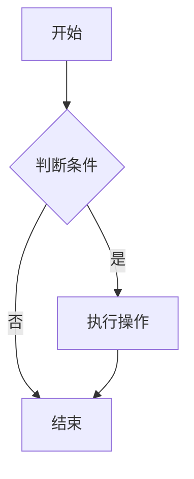
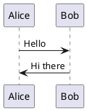

# Firefly 主题功能展示

> 本文集中展示 Firefly 博客主题支持的全部功能特性。

---

## 一、Markdown 基础与扩展

Firefly 支持标准 Markdown 语法，并通过 rehype/remark 插件扩展了更多功能。

### 基础语法

**粗体**、*斜体*、~~删除线~~、`行内代码`

### 扩展功能

#### 提醒框（Admonitions）

> [!NOTE]
> 这是一条普通提示。

> [!TIP]
> 这是一个小技巧。

> [!IMPORTANT]
> 这是重要信息。

> [!WARNING]
> 这是警告信息。

> [!CAUTION]
> 这是危险警告。

#### 折叠面板

<details>
<summary>点击展开更多内容</summary>

这里是折叠的内容，适合隐藏大段代码或次要信息。
</details>

---

## 二、代码块

### 语法高亮

```java
public class HelloWorld {
    public static void main(String[] args) {
        System.out.println("Hello, Firefly!");
    }
}
```

```python
def fibonacci(n):
    if n <= 1:
        return n
    return fibonacci(n-1) + fibonacci(n-2)
```

### 代码块功能

- 🌈 语法高亮（支持 100+ 语言）
- 📋 一键复制按钮
- 🏷️ 语言标签
- 📦 可折叠长代码

---

## 三、图表支持

### Mermaid 流程图



### PlantUML 时序图



---

## 四、数学公式（KaTeX）

行内公式：$E = mc^2$

独立公式：

$$
\int_0^\infty e^{-x^2} dx = \frac{\sqrt{\pi}}{2}
$$

矩阵：

$$
\begin{pmatrix}
a & b \\
c & d
\end{pmatrix}
$$

---

## 五、视频嵌入

支持 Bilibili、YouTube 等平台视频嵌入：

<!-- 示例：B站视频 -->
<iframe src="//player.bilibili.com/player.html?bvid=BV1xx411c7mD" 
        scrolling="no" border="0" frameborder="no" framespacing="0" 
        allowfullscreen="true" width="100%" height="450px">
</iframe>

---

## 六、文章加密

Firefly 支持对敏感文章设置密码保护，读者需要输入密码才能查看内容。

---

## 七、其他功能一览

| 功能 | 说明 |
|------|------|
| 🔍 全文搜索 | 内置 Pagefind 搜索 |
| 🌓 明暗主题 | 自动跟随系统 / 手动切换 |
| 📱 响应式 | 手机/平板/桌面全适配 |
| 🏷️ 标签系统 | 按标签筛选文章 |
| 📂 分类系统 | 按分类浏览 |
| 💬 评论系统 | 支持 Waline / Giscus |
| 📡 RSS 订阅 | 自动生成 RSS Feed |
| 🔗 友链页面 | 支持友链申请 |
| 📊 番剧追踪 | 集成 Bangumi |
| 🖼️ 相册功能 | 图片画廊展示 |

---

> 💡 Firefly 是一款基于 Astro 框架和 Fuwari 模板开发的清新美观的现代化个人博客主题。
