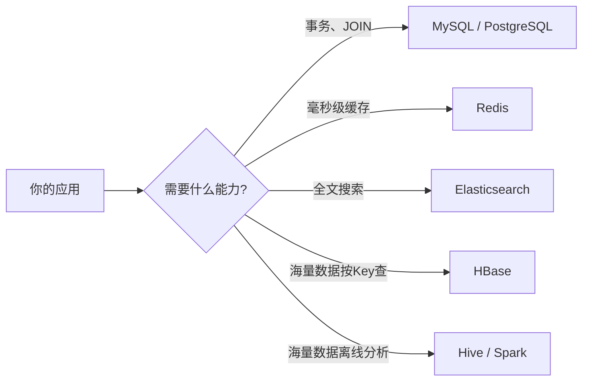
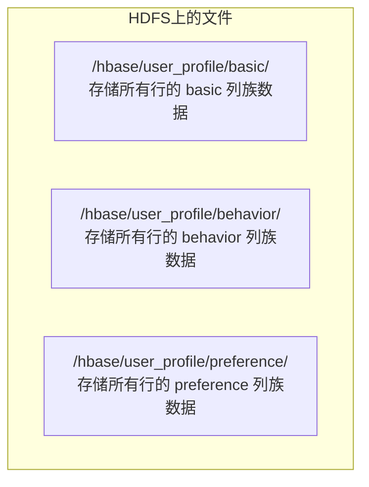
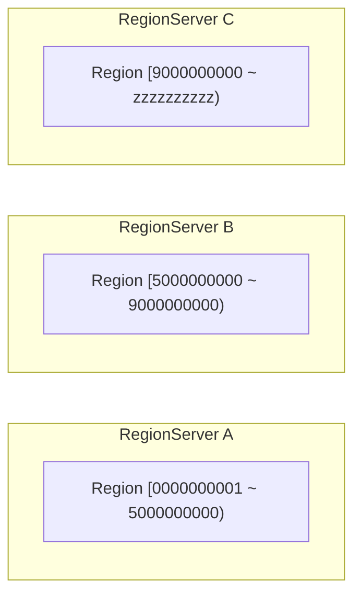
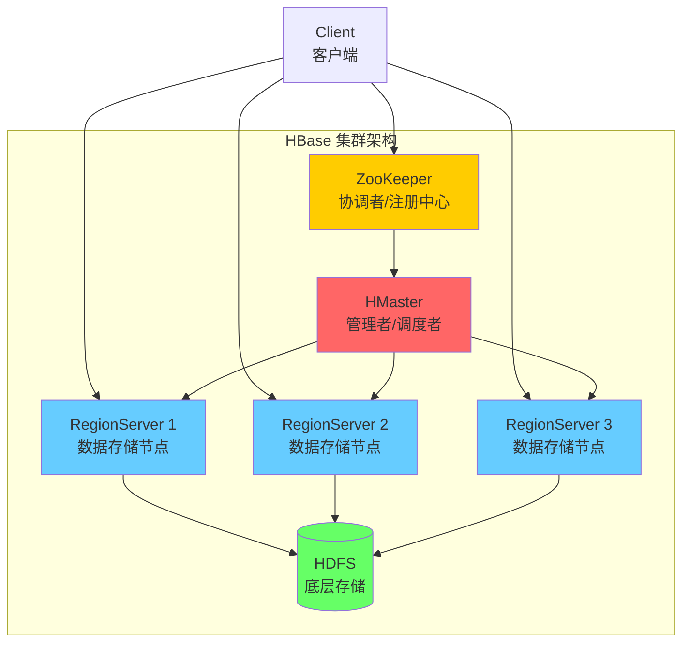
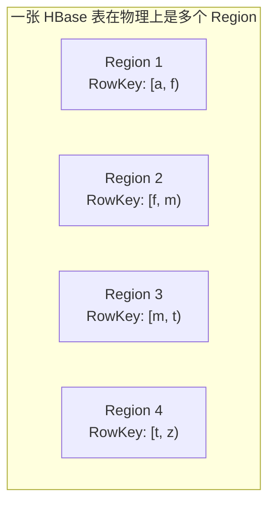
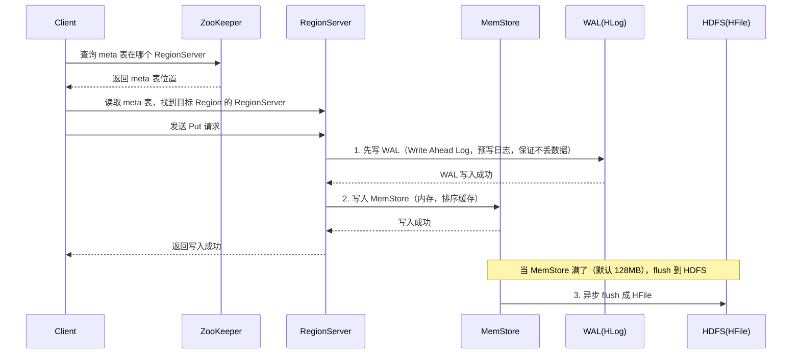
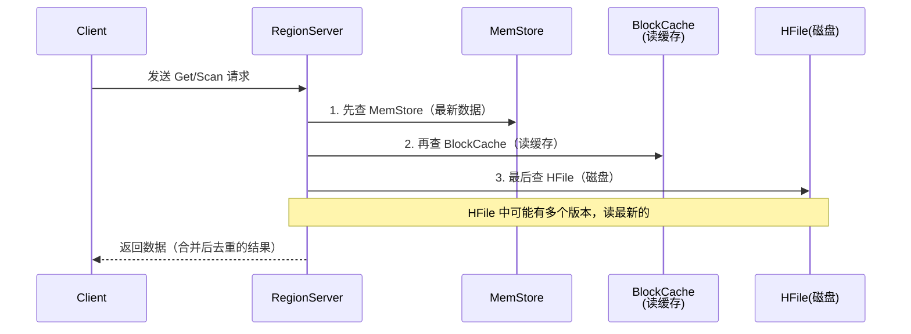
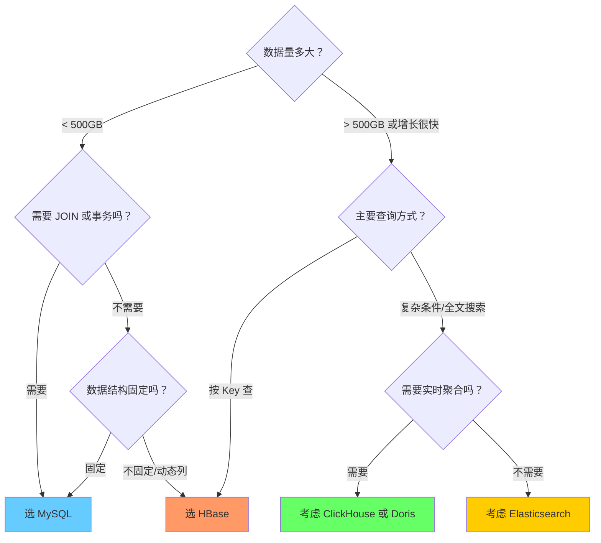
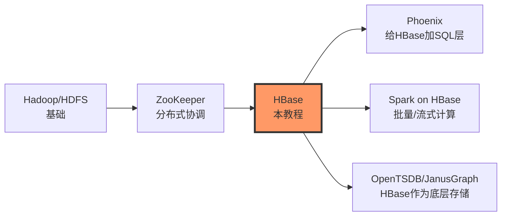

# HBase 从零到上手

---

## 序言：这份笔记是写给谁的

这份笔记假设你**只有 Java 和 MySQL 的底子**，对 Hadoop 生态几乎不了解。我不会用"分布式列式存储"这种吓人的词开头（虽然 HBase 确实是这个），而是用你熟悉的东西类比，一步步带你理解 HBase 是什么、为什么需要它、怎么用。

> [!tip] 阅读建议
> 前两章是"建立直觉"，不要跳。后面的操作命令和代码建议边看边动手。如果你对 Hadoop/HDFS 完全没概念，先去花 15 分钟看 Hadoop从零到上手 的前三章再回来。

---

## 第一章：HBase 是什么——人话版

### 1.1 从一个故事开始

你在一家电商公司上班，起初用 MySQL 存用户信息，一切都很美好：

```sql
SELECT * FROM users WHERE id = 10086;
```

10 毫秒返回，完美。

后来公司做大，用户涨到 **10 亿**。你发现 MySQL 扛不住了——分库分表、读写分离、中间件（比如 MyCat、ShardingSphere）全上了，运维痛不欲生。

更要命的是，老板说："咱们每天产生 **TB 级**的用户行为日志，你给我存起来，还要能实时查。"

你说："MySQL 行，按日期分表……"
老板："200 列，而且每个用户的列还不一样。"
你："……"

这就是 HBase 的登场场景。

### 1.2 HBase 的官方定义（人话翻译版）

**官方说法**：HBase 是运行在 Hadoop/HDFS 之上的分布式、可扩展、面向列的 NoSQL 数据库。

**人话翻译**：

| 官方词汇 | 人话 |
|----------|------|
| 分布式 | 数据分散在很多台机器上，一台挂了不丢数据 |
| 可扩展 | 加机器就能扛更多数据，不用改代码 |
| 面向列 | 数据按"列族"组织，查询时只读需要的列，不浪费 IO |
| NoSQL | 不用 SQL 查询，没有 JOIN，表之间没关系 |
| 运行在 HDFS 之上 | 数据最终存在 HDFS 文件系统里，天然高可用 |

> [!tip] 一句话总结
> **HBase = 一个能存几十亿行、几百万列的超级大表，按 RowKey 查数据极快，但没有 SQL 和表关联。**

### 1.3 HBase 和其他存储的对比

这是很多初学者最迷惑的地方："我有 MySQL，有 Redis，有 ES，为什么还要学 HBase？"

| 数据库 | 适合场景 | 不适合场景 | 类比 |
|--------|----------|------------|------|
| **MySQL** | 事务（转账）、关联查询、几百GB以内 | 几十亿行数据、几千列 | 一个整理得井井有条的文件柜 |
| **Redis** | 热点数据缓存、计数器、排行榜、毫秒级响应 | 数据量超过内存、需要持久化查询 | 你桌上的便签纸，伸手就能拿到 |
| **Elasticsearch** | 全文搜索、日志检索、复杂条件过滤 | 高频写入、需要事务 | 图书馆的索引系统，查书极快 |
| **HBase** | 几十亿行、TB~PB级、按 RowKey 实时读写 | 复杂条件查询、事务、JOIN | 一个无限大的仓库，按货架号找东西极快 |



> [!warning] 关键认知
> HBase 不是 MySQL 的替代品，也不是 Redis 的竞争对手。**每种存储各司其职**，在生产环境中它们通常是**配合使用**的。比如：用户画像存在 HBase，热点数据缓存在 Redis，订单存在 MySQL，日志索引用 ES。

---

## 第二章：HBase 的核心概念——全部用人话类比

这一章是最重要的。理解了这几个概念，HBase 就懂了一半。

### 2.1 数据模型全景图（先看大图）

把 HBase 的一张表想象成一个**三维空间**：

```mermaid
graph TD
    subgraph "HBase 表 = 三维存储空间"
        D1[维度1: RowKey<br/>确定"哪一行"<br/>相当于MySQL的主键]
        D2[维度2: Column Family:Qualifier<br/>确定"哪一列"<br/>相当于MySQL的列名]
        D3[维度3: Timestamp<br/>确定"哪个版本"<br/>MySQL没有这个维度]
    end
```

> [!tip] 人话类比
> **RowKey + Column + Timestamp** 三个值才能唯一确定一个"单元格"。这就像"张三（RowKey）在2024年（Timestamp）的数学成绩（Column）= 95分（Value）"——换了年份，成绩可能就不同了。

### 2.2 RowKey（行键）——身份证号

**人话类比**：RowKey 就像你的**身份证号**，是整个 HBase 世界的核心。

- 每一行数据都有一个唯一的 RowKey
- HBase 中所有数据**按 RowKey 的字典序排序存储**
- 查询数据 99% 的情况都是通过 RowKey（或 RowKey 范围）来查
- **没有二级索引**（除非你用 Phoenix 等工具）

```
RowKey 决定了数据的物理存储顺序。
RowKey 设计得好，查询就快；
RowKey 设计得烂，性能就灾难。
```

> [!warning] 这是最重要的知识
> 在 HBase 中，**RowKey 设计**是决定系统成败的核心因素。类比 MySQL：MySQL 中索引设计不当只会让查询变慢；而 HBase 中 RowKey 设计不当会导致**数据热点**（所有请求打在同一台机器上），整个集群都会受影响。后面会专门用一章讲 RowKey 设计。

### 2.3 Column Family（列族）——文件柜的抽屉

**人话类比**：列族就像文件柜的**抽屉**。

- 一个表可以有多个列族（建议不超过 3 个，实际生产通常只有 1 个）
- 列族是**物理存储**的基本单位：同一个列族的数据存在一起
- 建表时必须定义列族，列族名不能随便改

```
文件柜 (HBase Table)
├── 抽屉1: "基本信息" (Column Family: basic)
│   ├── 姓名 (Qualifier: name)
│   ├── 年龄 (Qualifier: age)
│   └── 性别 (Qualifier: gender)
│
├── 抽屉2: "联系方式" (Column Family: contact)
│   ├── 手机号 (Qualifier: phone)
│   ├── 邮箱 (Qualifier: email)
│   └── 地址 (Qualifier: address)
│
└── 抽屉3: "财务信息" (Column Family: finance)
    ├── 余额 (Qualifier: balance)
    └── VIP等级 (Qualifier: vip_level)
```

> [!tip] 设计原则
> 1. **列族数量越少越好**，大多数场景 1 个就够了
> 2. 把经常一起查询的列放在同一个列族
> 3. 列族名尽量短（因为每个单元格都会存列族名），比如用 `d` 代替 `detail`, 用 `f` 代替 `finance`

### 2.4 Column Qualifier（列限定符）——抽屉里的文件夹

**人话类比**：Qualifier 是列族这个"抽屉"里面的**文件夹**。

- Qualifier 就是具体的列名
- 不同**行**可以有不同的 Qualifier——这在 MySQL 中是不可能的！
- Qualifier 可以**动态添加**，不需要提前声明

```java
// MySQL: 所有行的列结构必须一致
// 第1行: name, age, phone
// 第2行: name, age, phone  ← 必须和第一行一样

// HBase: 每行可以有不同的列
// RowKey=张三: basic:name="张三", basic:age=20, contact:phone="13800138000"
// RowKey=李四: basic:name="李四", basic:age=25, contact:email="lisi@test.com"
//                            ↑ 李四没有 phone 列，但有 email 列，完全没毛病
```

这就是**稀疏存储**的核心：不存在的列**不占空间**。

### 2.5 Timestamp（时间戳）——时光机

**人话类比**：时间戳让 HBase 有了**时光机能力**。

- 同一个单元格可以存**多个版本**的数据
- 每个版本用时间戳区分（通常就是写入时间的毫秒数）
- 默认读最新版本，但也可以读历史版本
- 可以配置一个列族保留几个版本（比如只保留最近 3 个版本）

```
RowKey="10086", Column="basic:name"
  ├── timestamp=1702800000000, value="张三"      ← 最新
  ├── timestamp=1702700000000, value="张小三"    ← 历史版本
  └── timestamp=1702600000000, value="张老三"    ← 更早的版本

// Get 默认读到 "张三"（最新版本）
// 可以指定版本数：get 'user', '10086', {COLUMN=>'basic:name', VERSIONS=>3}
```

> [!tip] 这有什么实际用处？
> - **数据回溯**：查看用户某个字段的历史变更
> - **冲突解决**：分布式系统中数据版本管理
> - **回滚**：发现数据写错了，可以回退到老版本

### 2.6 稀疏存储——不存在就不占地方

**人话类比**：稀疏存储就像填表格——**空着的地方不占用任何纸张**。

```
MySQL 方式（稠密存储）：
┌────────┬──────┬──────┬──────────┬──────────┬──────────┐
│ RowKey │ col1 │ col2 │   col3   │   col4   │   col5   │
├────────┼──────┼──────┼──────────┼──────────┼──────────┤
│   001  │  A   │ NULL │   NULL   │   NULL   │    B     │  ← 3个NULL占空间
│   002  │ NULL │ NULL │    C     │   NULL   │   NULL   │  ← 4个NULL占空间
└────────┴──────┴──────┴──────────┴──────────┴──────────┘

HBase 方式（稀疏存储）：
┌────────┬─────────┬───────┐
│ RowKey │ Column  │ Value │
├────────┼─────────┼───────┤
│  001   │  col1   │   A   │  ← 只存有的数据
│  001   │  col5   │   B   │
│  002   │  col3   │   C   │
└────────┴─────────┴───────┘
```

这就是为什么 HBase 能存**海量稀疏数据**——如果你的表有几百万列但每行只有几十个值，MySQL 会疯掉，HBase 毫无压力。

---

## 第三章：数据模型实例——用一张"用户表"彻底搞懂

### 3.1 场景描述

假设我们要存一个超级用户画像系统，字段非常多，但每个用户的字段不完全相同。

### 3.2 建表语句（先看结构）

```
hbase(main):001:0> create 'user_profile', 'basic', 'behavior', 'preference'
```

等价于定义：

| 表名 | 列族 | 说明 |
|------|------|------|
| user_profile | basic | 基本信息（姓名、年龄、性别、手机号等） |
| user_profile | behavior | 行为数据（最近登录时间、浏览记录、购买记录等） |
| user_profile | preference | 偏好数据（喜欢的品类、价格区间、品牌偏好等） |

### 3.3 实际数据示例

假设我们有 3 个用户，以下是数据在 HBase 中的**逻辑视图**：

```
┌──────────┬───────────────────────┬──────────────────────────┬─────────────────────────────────┐
│ RowKey   │ basic                 │ behavior                 │ preference                      │
├──────────┼───────────────────────┼──────────────────────────┼─────────────────────────────────┤
│ 10086    │ basic:name="张三"     │ behavior:last_login=     │ preference:category="电子产品"  │
│          │ basic:age=28          │   1702800000000          │ preference:price_range="1000-   │
│          │ basic:gender="男"     │ behavior:order_count=156 │   5000"                         │
│          │ basic:phone=          │ behavior:browse_history= │ preference:brands="Apple,       │
│          │   "13800138000"       │   "item1,item2,item3"    │   Huawei,Xiaomi"                │
├──────────┼───────────────────────┼──────────────────────────┼─────────────────────────────────┤
│ 10087    │ basic:name="李四"     │ behavior:last_login=     │ preference:category="图书"      │
│          │ basic:age=35          │   1702750000000          │ preference:tags="科幻,推理,      │
│          │ basic:email=          │ behavior:order_count=23  │   历史"                         │
│          │   "lisi@test.com"     │                          │ preference:reading_time=        │
│          │                       │                          │   "night"                       │
├──────────┼───────────────────────┼──────────────────────────┼─────────────────────────────────┤
│ 10088    │ basic:name="王五"     │ behavior:last_login=     │ preference:category="运动户外"  │
│          │ basic:age=22          │   1702780000000          │ preference:sports="跑步,游泳"   │
│          │ basic:gender="男"     │ behavior:avg_session=    │                                 │
│          │ basic:phone=          │   35                     │                                 │
│          │   "13900139000"       │ behavior:order_count=8   │                                 │
│          │ basic:register_date=  │                          │                                 │
│          │   "2024-01-15"        │                          │                                 │
└──────────┴───────────────────────┴──────────────────────────┴─────────────────────────────────┘
```

### 3.4 关键观察（请仔细看上面的表）

> [!tip] 从这张表能看出什么？

1. **每行的列不一样**：张三有 `basic:phone` 但李四没有（李四有 `basic:email`）；王五有 `basic:register_date` 但其他人都没有。
2. **不存在的列不占空间**：李四的 `behavior:browse_history` 格子是空的，物理上它就是不存在，不占任何存储。
3. **有些格子很"宽"**：`preference:brands` 的值可以是逗号分隔的长字符串。
4. **时间戳是隐含的**：上面我简化了，实际上每个格子背后都有一个时间戳（写入时自动记录）。

### 3.5 物理存储视角（底层是怎么存的）

上面是逻辑视图，物理上 HBase 是按**列族**分开存储的：



**物理存储格式（HFile 内部）**：

```
# basic 列族的物理存储 (key-value 格式，按 RowKey+Column+Timestamp 排序)

10086 basic:age     1702800000000  -> 28
10086 basic:gender  1702800000000  -> 男
10086 basic:name    1702800000000  -> 张三
10086 basic:phone   1702800000000  -> 13800138000
10087 basic:age     1702750000000  -> 35
10087 basic:email   1702750000000  -> lisi@test.com
10087 basic:name    1702750000000  -> 李四
10088 basic:age     1702780000000  -> 22
10088 basic:gender  1702780000000  -> 男
10088 basic:name    1702780000000  -> 王五
10088 basic:phone   1702780000000  -> 13900139000
10088 basic:register_date 1702780000000 -> 2024-01-15
```

> [!warning] 重要理解
> 同一个列族的数据在物理上存在一起。你只查 `basic:name` 和 `basic:age` 时，不需要扫描 `behavior` 和 `preference` 列族的文件。这就是**列式存储的优势**。

---

## 第四章：RowKey 设计——HBase 最重要的知识

如果你只看这一章的内容，也要把这章看完。RowKey 设计是 HBase 的命门。

### 4.0 为什么要煞费苦心设计 RowKey？

HBase 的数据**按 RowKey 字典序排序存储**，并且数据会被**分片（Region）**分布到不同机器上。



> [!warning] 致命问题：热点（Hotspotting）
> 如果你的 RowKey 是**单调递增**的（比如自增 ID、时间戳），所有新写入的数据都会落到同一个 Region（最后一个），导致单台机器被打爆，其他机器闲得发慌。

### 4.1 设计原则总览

| 原则 | 说明 | 反例 |
|------|------|------|
| **长度适中** | 越长占用越多存储（每个单元格都存 RowKey） | RowKey 用 UUID（36字节） |
| **散列性** | RowKey 应该均匀分散，避免热点 | 用自增 ID 或时间戳做 RowKey |
| **业务含义** | 尽量把查询条件编入 RowKey | RowKey 里有高维度前缀（多变的在前面） |
| **定长** | 如果可能，让 RowKey 定长，方便扫描 | 不同长度导致字典序不符合预期 |

### 4.2 设计模式一：加盐（Salting）——最常用

**思路**：在 RowKey 前面加一个随机前缀，把数据打散。

**场景**：每天产生大量日志，RowKey 是时间戳，写入热点严重。

```java
// ❌ 糟糕的设计——所有写入都堆在最后一个 Region
String rowkey = String.valueOf(System.currentTimeMillis());
// rowkey = "1702800000000", "1702800000001", "1702800000002" ...
// 字典序上，它们连续地落在最后一个 Region

// ✅ 加盐设计——前面加随机数
int salt = ThreadLocalRandom.current().nextInt(100);  // 0-99
String rowkey = String.format("%02d_%d", salt, System.currentTimeMillis());
// rowkey = "37_1702800000000", "05_1702800000001", "82_1702800000002" ...
// 现在数据均匀分布在 100 个盐值对应的 Region 中
```

**查询时怎么办？**

```java
// 查一条数据：需要遍历 100 个盐值（或用索引表）
for (int i = 0; i < 100; i++) {
    String rowkey = String.format("%02d_%s", i, userId);
    // 在每个盐值下查一次
}
// 查一个范围：很麻烦，所以加盐适合"点查"场景
```

> [!warning] 加盐的代价
> 加盐破坏了 RowKey 的连续性。如果你想扫描某个时间范围的数据，需要扫描 100 次（每个盐值一次）。所以加盐适合**点查询为主**的场景（比如用户信息查询），**不适合范围扫描为主**的场景（比如时序分析）。

### 4.3 设计模式二：哈希前缀——兼顾散列和可预测性

**思路**：对关键字段做 Hash，取前几位做前缀。这样数据既分散又可以"算"出 RowKey。

**场景**：用户表，RowKey 是 userId，需要均匀分布。

```java
// ❌ 糟糕的设计
String rowkey = userId;  // "user_00001", "user_10002" ...
// 如果 user 表的主键是自增的，还是会热点

// ✅ 哈希前缀设计
String hashPrefix = DigestUtils.md5Hex(userId).substring(0, 4);  // 取 MD5 前4位
String rowkey = hashPrefix + "_" + userId;
// rowkey = "a3f2_user_00001", "7b1c_user_00002", "e9d4_user_00003" ...
// 数据被 MD5 前缀均匀分散了

// 查询时：用同样的 hash 算法计算出 RowKey 前缀，直接定位
public String getRowKey(String userId) {
    String hashPrefix = DigestUtils.md5Hex(userId).substring(0, 4);
    return hashPrefix + "_" + userId;
}
// 查一条数据只需要一次 Get，因为 hash 是可计算的！
```

> [!tip] 哈希前缀 vs 加盐
> | 对比维度 | 加盐 | 哈希前缀 |
> |----------|------|----------|
> | 点查询 | 需要遍历所有盐值 | 一次定位 |
> | 范围扫描 | 很困难 | 可以扫描（按 hash 前缀范围） |
> | 实现复杂度 | 低 | 中等 |
> | 散列均匀度 | 取决于盐值范围 | 取决于 hash 算法 |
> | 推荐场景 | 不需要扫描的场景 | 通用场景，**更推荐** |

### 4.4 设计模式三：反转（Reversing）——把热点变成均匀分布

**思路**：把 RowKey 中"变化较慢"的部分反转，让它在字典序上变得离散。

**场景**：手机号作为 RowKey，但手机号的前几位（网号）变化很慢。

```java
// ❌ 糟糕的设计
String rowkey = "13800138000";    // 手机号
String rowkey = "13800138001";
String rowkey = "13800138002";
// 前 3 位 "138" 都一样，导致这些 RowKey 在字典序上挤在一起

// ✅ 反转设计
String rowkey = new StringBuilder("13800138000").reverse().toString();
// rowkey = "0083100831"
String rowkey = new StringBuilder("13900139000").reverse().toString();
// rowkey = "0093100931"
// 反转后，变化的尾数变成了前缀，数据均匀分散了
```

**更常见的例子——URL 的反转**：

```java
// ❌ 糟糕的设计
// www.example.com/page1
// www.example.com/page2
// www.example.com/page3
// ↑ 所有以 www.example.com 开头的 URL 都挤在同一 Region

// ✅ 反转域名
// com.example.www/page1
// com.example.www/page2
// com.example.www/page3
// ↑ 按域名后缀反向排列，不同域名自然分散
```

> [!tip] 反转适合什么场景？
> **前缀重复度高、后缀变化多的数据**——手机号、身份证号、URL、特定格式的业务编码。这些数据的共同特点：开了头的部分千篇一律，真正区分数据的部分在后面。

### 4.5 设计模式四：复合 RowKey ——多查询条件融合

**思路**：把多个查询条件拼接成 RowKey，利用字典序实现"前缀扫描"。

**场景**：监控表，经常按"服务器ID + 时间范围"查询。

```java
// ✅ 复合 RowKey 设计
// RowKey = serverId + "_" + timestamp(反转)
String reversedTimestamp = String.valueOf(Long.MAX_VALUE - System.currentTimeMillis());
String rowkey = serverId + "_" + reversedTimestamp;
// rowkey = "web-server-01_9223370399968525807"

// 查询"最近1小时 web-server-01 的数据"：
// startRow = "web-server-01_" + (Long.MAX_VALUE - now)
// stopRow  = "web-server-01_" + (Long.MAX_VALUE - (now - 3600000))
// 用 scan 的 startRow/stopRow 做范围扫描，极快！
```

> [!tip] 复合 RowKey 的设计技巧
> 1. **高维度在前，低维度在后**：把查询中最常用的等值条件放前面
> 2. **时间戳反转**：把时间戳放后面时，反转一下能让最新数据排在前面（因为字典序默认升序）
> 3. **分隔符用特殊字符**：如 `_` `|` `#`，避免不同字段值粘连导致误扫描

### 4.6 RowKey 设计清单（Checklist）

在做 HBase 表设计时，逐条检查：

- [ ] RowKey 长度是否合理？（建议 10-100 字节，不要超过 1KB）
- [ ] 是否存在写入热点？（自增 ID、连续时间戳？）
- [ ] 散列策略是否和查询模式匹配？（点查用 hash，范围查用复合 key）
- [ ] 复合 RowKey 的分隔符是否不会出现在业务数据中？
- [ ] 时间戳是否需要反转（让新数据靠前）？
- [ ] 有没有利用字典序做前缀扫描？（where a=? and b>? 类型的查询）

---

## 第五章：基本操作——HBase Shell 命令速查

### 5.1 环境准备

```bash
# 进入 HBase Shell
hbase shell

# 退出
hbase(main):001:0> exit
```

### 5.2 表操作（DDL）

```bash
# 1. 创建表（必须指定至少一个列族）
create 'student', 'info'                         # 单列族，最简单

# 2. 创建多列族表
create 'student', 'info', 'score'                # 两个列族

# 3. 创建表并指定参数
create 'student',                                 \
  {NAME => 'info', VERSIONS => 3},                \  # info列族保留3个版本
  {NAME => 'score', VERSIONS => 1,                \  # score列族保留1个版本
                    TTL => 2592000}                  # score列族数据30天过期(秒)

# 4. 查看所有表
list

# 5. 查看表结构
describe 'student'                                # 或 desc 'student'

# 6. 检查表是否存在
exists 'student'

# 7. 禁用/启用表（修改结构前需要先禁用）
disable 'student'
enable 'student'

# 8. 删除表（必须先禁用）
disable 'student'
drop 'student'

# 9. 修改列族（增加/修改）
alter 'student', NAME => 'contact', VERSIONS => 5  # 新增列族
alter 'student', NAME => 'info', VERSIONS => 5     # 修改已有列族参数
alter 'student', 'delete' => 'contact'             # 删除列族
```

### 5.3 数据操作（DML）

```bash
# ============ 写入数据: put ============

# 插入单个单元格
put 'student', '10001', 'info:name', '张三'        # put 表名 RowKey 列族:列名 值
put 'student', '10001', 'info:age', '20'
put 'student', '10001', 'score:math', '95'
put 'student', '10001', 'score:english', '88'

# 插入时指定时间戳（默认用系统时间）
put 'student', '10001', 'info:name', '张三', 1702800000000

# 写入多行（批量场景可以写脚本循环）
put 'student', '10002', 'info:name', '李四'
put 'student', '10002', 'info:age', '22'

# ============ 读取数据: get ============

# 获取一行中所有列的数据
get 'student', '10001'                             # 返回整行的所有列

# 获取一行中指定列族的数据
get 'student', '10001', 'info'                     # 只返回 info 列族

# 获取一行中指定列的数据
get 'student', '10001', 'info:name'                # 只返回 name 列

# 获取多个版本
get 'student', '10001', {COLUMN => 'info:name', VERSIONS => 3}

# 获取指定时间戳范围的数据
get 'student', '10001', {COLUMN => 'info:name', TIMERANGE => [1702700000000, 1702800000000]}

# 获取指定时间戳的数据
get 'student', '10001', {COLUMN => 'info:name', TIMESTAMP => 1702800000000}

# ============ 扫描数据: scan ============

# 全表扫描（慎用！生产环境大数据表会扫很久）
scan 'student'                                     # 会扫全表，生产慎用！

# 范围扫描（最常用的查询方式）
scan 'student', {STARTROW => '10001', STOPROW => '10005'}  # [10001, 10005) 左闭右开

# 带前缀过滤的扫描
scan 'student', {ROWPREFIXFILTER => '100'}         # RowKey 以 100 开头的所有行

# 限制返回列
scan 'student', {COLUMNS => ['info:name', 'info:age']}   # 只返回指定列

# 限制返回行数
scan 'student', {LIMIT => 10}                      # 最多返回10行

# 组合使用
scan 'student', {
  STARTROW => '10001',
  STOPROW => '10010',
  COLUMNS => ['info:name', 'score:math'],
  LIMIT => 5
}

# 扫描并过滤（过滤器后面会讲）
scan 'student', {FILTER => "ValueFilter(=, 'binary:张三')"}

# ============ 删除数据: delete ============

# 删除某个单元格（最新版本）
delete 'student', '10001', 'info:age'              # 删除 age 列的最新版本

# 删除某个单元格的指定版本
delete 'student', '10001', 'info:age', 1702800000000

# 删除一整行的所有数据
deleteall 'student', '10001'                       # 删除 RowKey=10001 的整行

# 删除一个列族的所有数据
delete 'student', '10001', 'info'                  # 会标记删除 info 列族下所有列

# ============ 计数: count ============

count 'student'                                     # 统计行数（扫描整个表，大表很慢）

# ============ 清空表: truncate ============

truncate 'student'                                  # 清空表数据（保留表结构）
```

### 5.4 过滤器 Filter（进阶查询）

HBase 的 Scan 可以带过滤器，支持更灵活的查询条件：

```bash
# 1. RowFilter: 按 RowKey 过滤
# 查找 RowKey = "10001" 的行
scan 'student', {FILTER => "RowFilter(=, 'binary:10001')"}

# 2. PrefixFilter: 按 RowKey 前缀过滤（常用！）
scan 'student', {FILTER => "PrefixFilter('100')"}

# 3. ColumnPrefixFilter: 按列名前缀过滤
# 返回所有列名以 'math' 开头的列
scan 'student', {FILTER => "ColumnPrefixFilter('math')"}

# 4. ValueFilter: 按值过滤（全表扫描，很慢，慎用！）
scan 'student', {FILTER => "ValueFilter(=, 'binary:张三')"}

# 5. SingleColumnValueFilter: 按指定列的值过滤（最常用）
# 查找 age=20 的行
import org.apache.hadoop.hbase.filter.SingleColumnValueFilter
import org.apache.hadoop.hbase.filter.CompareFilter
import org.apache.hadoop.hbase.filter.SubstringComparator

scan 'student', {FILTER => "SingleColumnValueFilter('info', 'age', =, 'binary:20')"}

# 6. FamilyFilter: 按列族过滤
scan 'student', {FILTER => "FamilyFilter(=, 'binary:info')"}

# 7. QualifierFilter: 按列名过滤
scan 'student', {FILTER => "QualifierFilter(=, 'binary:name')"}

# 8. 组合过滤器 (FilterList) —— shell 中较复杂，建议在 Java API 中使用
```

> [!warning] Filter 性能提醒
> HBase 的 Filter 是**服务端过滤**（在 RegionServer 上执行，不会把全量数据传到客户端），但它仍然是**全表扫描**（除非结合 `STARTROW/STOPROW`）。生产环境中大表不要随便 `scan` + `ValueFilter`，一定要限制 RowKey 范围！

### 5.5 实用 Shell 技巧

```bash
# 查看一个 Region 中的数据分布
# 先找到表的所有 region
list_regions 'student'

# 查看表的状态
status 'student'

# 强制 flush（将 MemStore 数据写到 HFile）
flush 'student'

# 手动触发 Major Compaction（合并小文件，生产慎用）
major_compact 'student'

# 查看 HBase 版本
version

# 查看当前连接的用户
whoami

# 执行 shell 脚本文件
hbase shell /path/to/script.hbase
```

---

## 第六章：Java API 快速上手（Spring Boot 环境）

### 6.1 依赖引入

```xml
<!-- pom.xml -->
<dependencies>
    <!-- Spring Boot Starter -->
    <dependency>
        <groupId>org.springframework.boot</groupId>
        <artifactId>spring-boot-starter-web</artifactId>
    </dependency>

    <!-- HBase Client -->
    <dependency>
        <groupId>org.apache.hbase</groupId>
        <artifactId>hbase-client</artifactId>
        <version>2.5.0</version>
        <exclusions>
            <!-- 排除自带的 slf4j，让 Spring Boot 统一管理日志 -->
            <exclusion>
                <groupId>org.slf4j</groupId>
                <artifactId>slf4j-log4j12</artifactId>
            </exclusion>
        </exclusions>
    </dependency>

    <!-- Lombok（可选，减少样板代码） -->
    <dependency>
        <groupId>org.projectlombok</groupId>
        <artifactId>lombok</artifactId>
        <optional>true</optional>
    </dependency>
</dependencies>
```

### 6.2 HBase 连接配置

```java
// application.yml
hbase:
  zookeeper:
    quorum: 127.0.0.1:2181           # ZooKeeper 地址（生产环境多个: "zk1:2181,zk2:2181,zk3:2181"）
    znode:
      parent: /hbase                  # ZNode 根路径（默认 /hbase）
  pool:
    max-size: 10                      # 连接池最大连接数
```

```java
// HBaseConfig.java
import org.apache.hadoop.conf.Configuration;
import org.apache.hadoop.hbase.HBaseConfiguration;
import org.apache.hadoop.hbase.client.Connection;
import org.apache.hadoop.hbase.client.ConnectionFactory;
import org.springframework.beans.factory.annotation.Value;
import org.springframework.context.annotation.Bean;
import org.springframework.context.annotation.Scope;
import org.springframework.stereotype.Component;

import java.io.IOException;

@Component
public class HBaseConfig {

    @Value("${hbase.zookeeper.quorum}")
    private String zkQuorum;

    @Value("${hbase.zookeeper.znode.parent:/hbase}")
    private String zkZnodeParent;

    /**
     * HBase Configuration Bean
     */
    @Bean
    public Configuration hbaseConfiguration() {
        Configuration config = HBaseConfiguration.create();
        config.set("hbase.zookeeper.quorum", zkQuorum);        // ZK地址
        config.set("zookeeper.znode.parent", zkZnodeParent);   // ZK中的HBase节点路径
        // 常用可选配置
        config.set("hbase.client.retries.number", "3");        // 重试次数
        config.set("hbase.client.operation.timeout", "5000");  // 操作超时(ms)
        return config;
    }

    /**
     * HBase Connection Bean
     * Connection 是重量级对象，整个应用只需要一个（单例）
     */
    @Bean(destroyMethod = "close")
    public Connection hbaseConnection(Configuration config) throws IOException {
        return ConnectionFactory.createConnection(config);
    }
}
```

### 6.3 表管理工具类

```java
// HBaseAdminUtil.java
import org.apache.hadoop.hbase.TableName;
import org.apache.hadoop.hbase.client.*;
import org.apache.hadoop.hbase.util.Bytes;
import org.springframework.beans.factory.annotation.Autowired;
import org.springframework.stereotype.Component;

import java.io.IOException;

@Component
public class HBaseAdminUtil {

    @Autowired
    private Connection connection;

    /**
     * 创建表
     * @param tableName  表名
     * @param families   列族名数组
     */
    public void createTable(String tableName, String... families) throws IOException {
        Admin admin = connection.getAdmin();
        TableName tn = TableName.valueOf(tableName);

        // 如果表已存在，先禁用再删除
        if (admin.tableExists(tn)) {
            admin.disableTable(tn);
            admin.deleteTable(tn);
        }

        // 构建列族描述符
        // TableDescriptorBuilder 是 2.x API；1.x 用 HTableDescriptor（已废弃）
        TableDescriptorBuilder builder = TableDescriptorBuilder.newBuilder(tn);
        for (String family : families) {
            ColumnFamilyDescriptor familyDesc = ColumnFamilyDescriptorBuilder
                .newBuilder(Bytes.toBytes(family))
                .setMaxVersions(3)           // 保留3个版本
                .setTimeToLive(2592000)      // TTL 30天（秒）
                .build();
            builder.setColumnFamily(familyDesc);
        }

        admin.createTable(builder.build());
        admin.close();
    }

    /**
     * 判断表是否存在
     */
    public boolean tableExists(String tableName) throws IOException {
        Admin admin = connection.getAdmin();
        boolean exists = admin.tableExists(TableName.valueOf(tableName));
        admin.close();
        return exists;
    }
}
```

### 6.4 数据操作工具类（核心 CRUD）

```java
// HBaseDataUtil.java
import org.apache.hadoop.hbase.Cell;
import org.apache.hadoop.hbase.CellUtil;
import org.apache.hadoop.hbase.TableName;
import org.apache.hadoop.hbase.client.*;
import org.apache.hadoop.hbase.filter.*;
import org.apache.hadoop.hbase.util.Bytes;
import org.springframework.beans.factory.annotation.Autowired;
import org.springframework.stereotype.Component;

import java.io.IOException;
import java.util.*;

@Component
public class HBaseDataUtil {

    @Autowired
    private Connection connection;

    // ==================== 写入操作 ====================

    /**
     * 插入或更新一个单元格
     * @param tableName 表名
     * @param rowKey    行键
     * @param family    列族
     * @param qualifier 列名
     * @param value     值
     */
    public void putCell(String tableName, String rowKey,
                        String family, String qualifier, String value)
            throws IOException {
        // 1. 获取表对象（轻量级，用完就关）
        Table table = connection.getTable(TableName.valueOf(tableName));

        // 2. 构建 Put 对象
        Put put = new Put(Bytes.toBytes(rowKey));
        put.addColumn(
            Bytes.toBytes(family),       // 列族
            Bytes.toBytes(qualifier),    // 列名
            Bytes.toBytes(value)         // 值（所有数据在 HBase 中都是 byte[]）
        );

        // 3. 执行写入
        table.put(put);
        table.close();
    }

    /**
     * 批量写入（生产环境推荐用这种方式，减少 RPC 次数）
     * @param tableName 表名
     * @param dataList  数据列表
     */
    public void putBatch(String tableName, List<Put> dataList) throws IOException {
        Table table = connection.getTable(TableName.valueOf(tableName));
        table.put(dataList);  // 一次 RPC 提交一批
        table.close();
    }

    /**
     * 构建 Put 对象的辅助方法
     * 在业务代码中构建好 List<Put>，一次性提交
     */
    public Put buildPut(String rowKey, String family,
                        Map<String, String> qualifierValueMap) {
        Put put = new Put(Bytes.toBytes(rowKey));
        for (Map.Entry<String, String> entry : qualifierValueMap.entrySet()) {
            put.addColumn(
                Bytes.toBytes(family),
                Bytes.toBytes(entry.getKey()),
                Bytes.toBytes(entry.getValue())
            );
        }
        return put;
    }

    /**
     * 存在则更新，否则插入（和 putCell 一样，HBase 的 put 本身就是 upsert）
     * HBase 的 Put 操作天然支持 upsert —— 不关心行是否已存在
     */
    public void upsert(String tableName, String rowKey,
                       String family, String qualifier, String value)
            throws IOException {
        putCell(tableName, rowKey, family, qualifier, value);
    }

    // ==================== 读取操作 ====================

    /**
     * 精确查询：根据 RowKey 获取一行数据
     */
    public Map<String, String> getRow(String tableName, String rowKey)
            throws IOException {
        Table table = connection.getTable(TableName.valueOf(tableName));
        Get get = new Get(Bytes.toBytes(rowKey));
        Result result = table.get(get);

        Map<String, String> rowMap = new HashMap<>();
        if (!result.isEmpty()) {
            for (Cell cell : result.rawCells()) {
                String family = Bytes.toString(CellUtil.cloneFamily(cell));
                String qualifier = Bytes.toString(CellUtil.cloneQualifier(cell));
                String value = Bytes.toString(CellUtil.cloneValue(cell));
                long timestamp = cell.getTimestamp();
                rowMap.put(family + ":" + qualifier, value);
            }
        }
        table.close();
        return rowMap;
    }

    /**
     * 精确查询：获取一行中指定列族的所有列
     */
    public Map<String, String> getRowWithFamily(String tableName, String rowKey,
                                                 String family) throws IOException {
        Table table = connection.getTable(TableName.valueOf(tableName));
        Get get = new Get(Bytes.toBytes(rowKey));
        get.addFamily(Bytes.toBytes(family));   // 只查指定列族，减少 IO
        Result result = table.get(get);

        Map<String, String> rowMap = new HashMap<>();
        for (Cell cell : result.rawCells()) {
            String qualifier = Bytes.toString(CellUtil.cloneQualifier(cell));
            String value = Bytes.toString(CellUtil.cloneValue(cell));
            rowMap.put(qualifier, value);
        }
        table.close();
        return rowMap;
    }

    /**
     * 精确查询：获取一行中指定列的值
     */
    public String getCell(String tableName, String rowKey,
                          String family, String qualifier) throws IOException {
        Table table = connection.getTable(TableName.valueOf(tableName));
        Get get = new Get(Bytes.toBytes(rowKey));
        get.addColumn(Bytes.toBytes(family), Bytes.toBytes(qualifier));
        Result result = table.get(get);

        byte[] value = result.getValue(Bytes.toBytes(family), Bytes.toBytes(qualifier));
        table.close();
        return value == null ? null : Bytes.toString(value);
    }

    /**
     * 获取一行中多个版本的数据
     */
    public List<String> getCellVersions(String tableName, String rowKey,
                                         String family, String qualifier,
                                         int versions) throws IOException {
        Table table = connection.getTable(TableName.valueOf(tableName));
        Get get = new Get(Bytes.toBytes(rowKey));
        get.addColumn(Bytes.toBytes(family), Bytes.toBytes(qualifier));
        get.readVersions(versions);  // 指定读取的版本数
        Result result = table.get(get);

        List<String> versionList = new ArrayList<>();
        for (Cell cell : result.getColumnCells(
                Bytes.toBytes(family), Bytes.toBytes(qualifier))) {
            versionList.add(Bytes.toString(CellUtil.cloneValue(cell)));
        }
        table.close();
        return versionList;
    }

    // ==================== 扫描操作 ====================

    /**
     * 范围扫描：扫描指定 RowKey 范围 [startRow, stopRow)
     */
    public List<Map<String, String>> scan(String tableName,
                                           String startRow, String stopRow)
            throws IOException {
        Table table = connection.getTable(TableName.valueOf(tableName));
        Scan scan = new Scan();
        scan.withStartRow(Bytes.toBytes(startRow));   // 包含
        scan.withStopRow(Bytes.toBytes(stopRow));      // 不包含（左闭右开）

        List<Map<String, String>> resultList = new ArrayList<>();
        ResultScanner scanner = table.getScanner(scan);
        for (Result result : scanner) {
            Map<String, String> rowMap = new HashMap<>();
            for (Cell cell : result.rawCells()) {
                String family = Bytes.toString(CellUtil.cloneFamily(cell));
                String qualifier = Bytes.toString(CellUtil.cloneQualifier(cell));
                String value = Bytes.toString(CellUtil.cloneValue(cell));
                rowMap.put(family + ":" + qualifier, value);
            }
            resultList.add(rowMap);
        }
        scanner.close();  // 记得关闭 Scanner
        table.close();
        return resultList;
    }

    /**
     * 前缀扫描：扫描 RowKey 以指定前缀开头的所有行
     * 这是生产中最常用的扫描模式！
     */
    public List<Map<String, String>> scanByPrefix(String tableName, String prefix)
            throws IOException {
        Table table = connection.getTable(TableName.valueOf(tableName));
        Scan scan = new Scan();
        scan.setRowPrefixFilter(Bytes.toBytes(prefix));

        List<Map<String, String>> resultList = new ArrayList<>();
        ResultScanner scanner = table.getScanner(scan);
        for (Result result : scanner) {
            Map<String, String> rowMap = new HashMap<>();
            for (Cell cell : result.rawCells()) {
                String qualifier = Bytes.toString(CellUtil.cloneQualifier(cell));
                String value = Bytes.toString(CellUtil.cloneValue(cell));
                rowMap.put(qualifier, value);
            }
            resultList.add(rowMap);
        }
        scanner.close();
        table.close();
        return resultList;
    }

    /**
     * 带过滤器的扫描：查找指定列等于指定值的所有行
     */
    public List<Map<String, String>> scanByColumnValue(String tableName,
                                                        String family,
                                                        String qualifier,
                                                        String value)
            throws IOException {
        Table table = connection.getTable(TableName.valueOf(tableName));
        Scan scan = new Scan();

        // 构建 SingleColumnValueFilter
        SingleColumnValueFilter filter = new SingleColumnValueFilter(
            Bytes.toBytes(family),
            Bytes.toBytes(qualifier),
            CompareOperator.EQUAL,
            Bytes.toBytes(value)
        );
        // 如果某行没有这个列，跳过该行
        filter.setFilterIfMissing(true);
        scan.setFilter(filter);

        List<Map<String, String>> resultList = new ArrayList<>();
        ResultScanner scanner = table.getScanner(scan);
        for (Result result : scanner) {
            Map<String, String> rowMap = new HashMap<>();
            for (Cell cell : result.rawCells()) {
                String q = Bytes.toString(CellUtil.cloneQualifier(cell));
                String v = Bytes.toString(CellUtil.cloneValue(cell));
                rowMap.put(q, v);
            }
            resultList.add(rowMap);
        }
        scanner.close();
        table.close();
        return resultList;
    }

    // ==================== 删除操作 ====================

    /**
     * 删除一个单元格
     */
    public void deleteCell(String tableName, String rowKey,
                           String family, String qualifier) throws IOException {
        Table table = connection.getTable(TableName.valueOf(tableName));
        Delete delete = new Delete(Bytes.toBytes(rowKey));
        // 删除指定列的最新版本
        delete.addColumn(Bytes.toBytes(family), Bytes.toBytes(qualifier));
        table.delete(delete);
        table.close();
    }

    /**
     * 删除整行
     */
    public void deleteRow(String tableName, String rowKey) throws IOException {
        Table table = connection.getTable(TableName.valueOf(tableName));
        Delete delete = new Delete(Bytes.toBytes(rowKey));
        table.delete(delete);
        table.close();
    }

    /**
     * 批量删除
     */
    public void deleteBatch(String tableName, List<Delete> deletes) throws IOException {
        Table table = connection.getTable(TableName.valueOf(tableName));
        table.delete(deletes);
        table.close();
    }

    // ==================== 检查操作 ====================

    /**
     * 判断行是否存在
     */
    public boolean exists(String tableName, String rowKey) throws IOException {
        Table table = connection.getTable(TableName.valueOf(tableName));
        Get get = new Get(Bytes.toBytes(rowKey));
        boolean exists = table.exists(get);
        table.close();
        return exists;
    }
}
```

### 6.5 完整示例：用户服务

```java
// UserService.java
import lombok.extern.slf4j.Slf4j;
import org.apache.hadoop.hbase.client.Put;
import org.springframework.beans.factory.annotation.Autowired;
import org.springframework.stereotype.Service;

import java.util.*;

@Slf4j
@Service
public class UserService {

    private static final String TABLE_NAME = "user_profile";
    private static final String CF_BASIC = "basic";
    private static final String CF_BEHAVIOR = "behavior";

    @Autowired
    private HBaseDataUtil hBaseDataUtil;

    /**
     * 保存用户信息
     */
    public void saveUser(String userId, String name, int age, String phone) {
        try {
            Map<String, String> basicMap = new HashMap<>();
            basicMap.put("name", name);
            basicMap.put("age", String.valueOf(age));
            basicMap.put("phone", phone);

            Put put = hBaseDataUtil.buildPut(userId, CF_BASIC, basicMap);
            hBaseDataUtil.putBatch(TABLE_NAME, Collections.singletonList(put));

            log.info("用户 {} 保存成功", userId);
        } catch (Exception e) {
            log.error("保存用户失败: {}", e.getMessage(), e);
            throw new RuntimeException("HBase 写入失败", e);
        }
    }

    /**
     * 查询用户基本信息
     */
    public Map<String, String> getUserBasic(String userId) {
        try {
            return hBaseDataUtil.getRowWithFamily(TABLE_NAME, userId, CF_BASIC);
        } catch (Exception e) {
            log.error("查询用户失败: {}", e.getMessage(), e);
            return Collections.emptyMap();
        }
    }

    /**
     * 查询用户某个字段
     */
    public String getUserField(String userId, String field) {
        try {
            return hBaseDataUtil.getCell(TABLE_NAME, userId, CF_BASIC, field);
        } catch (Exception e) {
            log.error("查询字段 {} 失败: {}", field, e.getMessage(), e);
            return null;
        }
    }

    /**
     * 记录用户行为（最近登录时间）
     */
    public void recordLogin(String userId) {
        try {
            hBaseDataUtil.putCell(TABLE_NAME, userId, CF_BEHAVIOR,
                "last_login", String.valueOf(System.currentTimeMillis()));
        } catch (Exception e) {
            log.error("记录登录时间失败: {}", e.getMessage(), e);
        }
    }

    /**
     * 批量查询用户（利用 RowKey 范围扫描）
     */
    public List<Map<String, String>> getUsersInRange(String startUserId, String endUserId) {
        try {
            return hBaseDataUtil.scan(TABLE_NAME, startUserId, endUserId);
        } catch (Exception e) {
            log.error("批量查询用户失败: {}", e.getMessage(), e);
            return Collections.emptyList();
        }
    }
}
```

### 6.6 关键注意事项

> [!warning] Java API 避坑指南

1. **Connection 是单例**：Connection 是重量级对象，整个应用共享一个即可。不要每次操作都创建一个新的 Connection。

2. **Table 不是线程安全的**：每个线程应该创建自己的 Table 实例，用完立即 close。或者用连接池管理。

3. **所有数据都是 byte[]**：HBase 中所有数据（RowKey、列族、列名、值）都是 `byte[]`。使用 `org.apache.hadoop.hbase.util.Bytes` 工具类做转换。

4. **批量操作优于单条**：能用 `put(List<Put>)` 就不循环调 `put(Put)`。减少 RPC 次数是提升性能的关键。

5. **Scan 用完要关闭**：`ResultScanner` 用完必须调用 `scanner.close()`，否则会泄漏资源。

6. **缓存和批处理**：大数据量 Scan 时设置 `setCaching(500)` 和 `setBatch(100)`，可以显著提升性能。

```java
// 优化后的 Scan（适用于大数据量扫描）
Scan scan = new Scan();
scan.setCaching(500);   // 每次 RPC 拉取 500 行（默认是1，太慢）
scan.setBatch(100);     // 每行返回 100 个列（如果列很多的话）
scan.setMaxResultSize(2 * 1024 * 1024);  // 单次返回结果限制 2MB
```

---

## 第七章：HBase 体系架构——理解它是怎么运行的

### 7.1 架构全景图



### 7.2 各组件职责（人话版）

| 组件 | 职责 | 人话类比 |
|------|------|----------|
| **HMaster** | 管理表结构、分配 Region、负载均衡、故障恢复 | 仓库管理员——分配货架、调度工人、处理请假 |
| **RegionServer** | 处理读写请求、管理 Region、执行 Compaction | 仓库工人——实际搬货、整理货物 |
| **ZooKeeper** | 集群元数据存储、HMaster 选举、健康检查 | 打卡机+公告栏——记录谁在干活、仓库地图在哪 |
| **HDFS** | 数据持久化存储、副本管理 | 仓库的地基底座——货架建在上面 |

### 7.3 Region——HBase 的分片单元



- **Region 是 HBase 数据分片的最小单位**
- 一张表初始可能只有一个 Region，数据多了会自动**分裂（Split）**成两个
- 每个 Region 由一个 RegionServer 负责
- Region 分裂对客户端透明，不需要修改代码

> [!tip] Region 的大小
> 默认 Region 大小配置为 `hbase.hregion.max.filesize`（默认 10GB），达到这个大小就会自动分裂。对于大表，合理调大这个值可以减少 Region 数量，减轻 HMaster 管理压力。

### 7.4 读写路径详解

#### 写数据路径



> [!tip] WAL 的重要性
> WAL 就像 MySQL 的 binlog。MemStore 是内存中的，如果服务器突然挂掉，没有 flush 到 HDFS 的数据就丢了。但因为有 WAL（先写磁盘），重启后可以 replay WAL 恢复数据。

#### 读数据路径



> [!warning] 读放大问题
> 一条数据可能分散在 MemStore + 多个 HFile 中。HBase 需要合并这些来源的数据，这个过程叫**读放大**。Minor/Major Compaction 就是为了减少文件数量，降低读放大。

### 7.5 Compaction——HBase 的"垃圾回收"

| 类型 | 触发条件 | 做了什么 | 影响 |
|------|----------|----------|------|
| **Minor Compaction** | 自动触发（小文件数量达到阈值） | 合并少量小 HFile | 轻微 IO 抖动，几乎无感 |
| **Major Compaction** | 自动触发（每天一次，或手动） | 合并所有 HFile，删除过期数据 | IO 飙升，可能影响线上读写 |

> [!warning] 生产环境 Major Compaction 建议
> **关闭自动 Major Compaction**，在业务低峰期手动执行！默认每天一次的全量合并可能在高负载时段造成严重性能影响。
> ```bash
> # shell 中手动合并一张表
> major_compact 'your_table'
> ```

---

## 第八章：HBase vs MySQL——什么时候用哪个

### 8.1 全方位对比

| 对比维度 | MySQL | HBase |
|----------|-------|-------|
| **数据模型** | 关系型，行和列，有 Schema 约束 | 列族模型，Schema-less（列可动态添加） |
| **查询方式** | SQL，支持 JOIN、子查询、聚合 | 仅通过 RowKey（或 RowKey 范围），没有 SQL |
| **事务** | ACID 事务 | 行级原子性（没有跨行事务） |
| **扩展方式** | 垂直扩展（换更好的机器）或分库分表 | 水平扩展（加机器），原生支持 |
| **数据量级** | GB ~ TB 级别 | TB ~ PB 级别 |
| **写入性能** | 中等，受索引维护影响 | 极高，顺序写入 |
| **随机读** | 快（走索引） | 极快（按 RowKey） |
| **范围扫描** | 快（走索引） | 极快（连续存储） |
| **全表扫描** | 慢 | 慢（但可以并行） |
| **存储效率** | 稠密存储，NULL 占空间 | 稀疏存储，NULL 不占空间 |
| **运维难度** | 低（成熟的工具链） | 高（Hadoop 生态，组件多） |
| **学习曲线** | 平缓 | 陡峭 |

### 8.2 判断标准——用决策树选择



### 8.3 典型场景速查表

| 场景 | 推荐 | 原因 |
|------|------|------|
| **电商订单** | MySQL | 需要事务（扣款+减库存）、关联查询（订单关联用户） |
| **用户画像（亿级）** | HBase | 数据量大、按 userId 查询、字段动态变化 |
| **实时日志存储** | HBase | 写入吞吐高、按时间范围扫描 |
| **金融交易流水** | MySQL | 强事务一致性、复杂统计分析 |
| **物联网传感器数据** | HBase | 海量设备、按设备ID+时间查询、写入量大 |
| **短网址映射** | HBase | 海量 KV 对、只需 Key-Value 查询、极高并发 |
| **社交关系（关注/粉丝）** | HBase | 数据量大、按用户ID查询、关系动态变化 |
| **文章内容管理** | MySQL | 需要复杂分类查询、标签关联、全文搜索 |

### 8.4 混合架构才是常态

> [!tip] 真实世界的架构
> 生产环境中几乎没有"只用 HBase"或"只用 MySQL"的系统。典型的架构是：
>
> ```
> ┌───────────────────────────────────────────┐
> │              业务应用层                      │
> ├──────┬──────┬──────┬──────┬───────────────┤
> │MySQL │Redis │HBase │  ES  │   对象存储     │
> │订单   │缓存   │画像   │搜索   │  图片/文件    │
> └──────┴──────┴──────┴──────┴───────────────┘
> ```
>
> 数据在它们之间通过 **CDC（Change Data Capture，变更数据捕获）** 或消息队列流转。比如一个用户注册后，基本信息写 MySQL，同时通过消息队列写入 HBase（用户画像）和 ES（用户搜索索引）。

---

## 第九章：避坑指南——生产环境常见问题

### 9.1 热点问题（最常见）

**现象**：集群中某个 RegionServer 的 CPU、IO 远高于其他节点。

**原因**：RowKey 设计不当，数据写入集中在少数 Region。

**解决方案**：
1. 加盐（Salting）—— RowKey 前加随机数
2. 哈希前缀 —— 对 RowKey 做 hash 取前缀
3. 反转 —— 对变化缓慢的 RowKey 前缀做反转
4. 预分区 —— 建表时预先创建多个 Region

```bash
# 预分区建表，避免写入热点
# 把 RowKey 空间预分成 10 个 Region
create 'my_table', 'cf', SPLITS => [
  '1|', '2|', '3|', '4|', '5|',
  '6|', '7|', '8|', '9|'
]

# 用十六进制均匀分 16 个分区
create 'my_table', 'cf', {
  NUMREGIONS => 16,
  SPLITALGO => 'HexStringSplit'
}
```

### 9.2 读放大问题

**现象**：单条 Get 查询很慢，尤其是刚做过大量写入之后。

**原因**：数据分散在 MemStore 和多个 HFile 中，需要合并多份文件。

**解决方案**：
1. 合理配置 MemStore 大小（太大会导致 GC 压力）
2. 调整 Compaction 策略
3. 使用 BucketCache 或 BlockCache 加速读

> [!tip] 生产环境内存配置建议
> ```
> RegionServer 堆内存：读缓存：写缓存 ≈ 60% : 25% : 15%
> 例如 32GB 堆 = 19GB 堆 + 8GB 读缓存(BlockCache) + 5GB 写缓存(MemStore)
> ```

### 9.3 JVM GC 问题

HBase 是 Java 写的，严重依赖 JVM。MemStore 满了会触发 GC。

**常见症状**：
- RegionServer 偶尔假死（STW，Stop The World）
- ZooKeeper 会话超时导致 RegionServer 被踢出集群

**解决方案**：
1. 使用 G1GC（JDK 8 以上推荐）
2. 合理设置 MemStore 大小
3. 监控 GC 日志

```bash
# RegionServer JVM 参数建议
-XX:+UseG1GC
-XX:MaxGCPauseMillis=100
-XX:InitiatingHeapOccupancyPercent=35
-Xmx32g -Xms32g
```

### 9.4 列族过多

**现象**：表设计了 5 个以上的列族，读性能低下。

**原因**：每个列族是一个独立的 Store（物理文件），多个列族意味着读取一行时要跨多个文件。而且 Flush 和 Compaction 是按列族独立进行的。

**解决方案**：**列族数尽量控制在 1-2 个**。如果列很多，在 Qualifier 维度上区分即可。

### 9.5 时间戳不是单调递增的

**现象**：`get` 获取多版本数据时，返回的版本不是你期望的那个。

**原因**：HBase 按时间戳**降序**排列（最新的在前），不是升序。同时需要注意写入的时间戳是客户端传入的，如果多台机器时钟不同步，可能出现版本错乱。

**解决方案**：
1. 客户端不传时间戳，让 HBase 用服务器时间
2. 如果必须传时间戳，确保所有客户端时钟同步（NTP）
3. 如果要确保顺序，可以考虑在 RowKey 中编码时间顺序而非依赖时间戳

### 9.6 常见错误排查速查表

| 错误信息 | 可能原因 | 解决方向 |
|----------|----------|----------|
| `NotServingRegionException` | Region 正在迁移或分裂 | 客户端自动重试即可，或刷新 meta 表 |
| `RegionTooBusyException` | Region 负载过高 | 增加分区数或检查热点 |
| `Connection refused` | ZK 或 HBase 未启动 | 检查 ZK 和 HBase Master/RegionServer 状态 |
| `ScannerTimeoutException` | Scan 时间过长 | 调大超时时间或缩小 Scan 范围 |
| `org.apache.hadoop.hbase.regionserver.NoSuchColumnFamilyException` | 访问了不存在的列族 | 检查列族名拼写，确认建表时已定义 |

---

## 第十章：常见面试题

### Q1: HBase 的数据模型是什么样的？和关系型数据库有什么区别？

**答**：HBase 是**稀疏、分布式、多维排序**的 Map。数据按 RowKey 字典序排序存储，由 RowKey + Column Family + Qualifier + Timestamp 四个维度定位一个值。和 MySQL 的核心区别：

- HBase 是 Schema-less 的，列可以动态添加，不同行的列可以不同
- HBase 没有 JOIN，没有 SQL，没有二级索引（原生）
- HBase 按列族物理存储，适合稀疏数据
- HBase 天然支持多版本（每个单元格按时间戳维护多个版本）
- MySQL 适合事务和关联查询，HBase 适合海量数据按 Key 查询

### Q2: 什么是 Region？Region 怎么分裂？

**答**：Region 是 HBase 数据分片的最小单位，一张表的数据被切分成多个 Region，每个 Region 存储一段连续的 RowKey 范围。当 Region 大小超过阈值（默认 10GB）时，会自动**分裂（Split）**成两个子 Region，各自负责一半的 RowKey 范围。分裂由 RegionServer 执行，对客户端透明。

关键点：Region 分裂后，子 Region 会先留在原来的 RegionServer 上，HMaster 后续会根据负载均衡策略将它们迁移到其他节点。

### Q3: HBase 的读写流程是怎样的？

**答**：

**写流程**：
1. Client 从 ZooKeeper 获取 meta 表所在 RegionServer
2. 通过 meta 表找到目标 Region 的 RegionServer
3. 先写 WAL（Write Ahead Log，预写日志，保证持久性）
4. 再写 MemStore（内存中的有序缓存）
5. MemStore 满了后 flush 到 HDFS 成为 HFile

**读流程**：
1. 同样先通过 ZK -> meta 表定位 RegionServer
2. 依次从 MemStore + BlockCache + HFile 读取
3. 将多个来源的数据合并去重，取最新版本返回

### Q4: RowKey 设计原则有哪些？如何避免热点？

**答**：

RowKey 设计原则：
1. **长度适中**：建议 10-100 字节，太短易冲突，太长浪费存储
2. **散列性**：数据均匀分布在各个 Region，避免热点
3. **业务含义**：将常用查询条件编码进 RowKey，利用字典序做前缀扫描
4. **定长**：让字典序行为可预测

避免热点的方法（三选一或组合）：
- **加盐**：前缀加随机数（适合纯点查）
- **哈希前缀**：对关键字段做 Hash（适合需要用 RowKey 定位单条数据的场景）
- **反转**：反转变化缓慢的字段（适合手机号、URL 等）
- **预分区**：建表时手动划分多个 Region

### Q5: MemStore 和 HFile 是什么关系？

**答**：

- **MemStore**：内存中的有序缓存（按 RowKey + Column + Timestamp 排序），数据先写到这里。每个列族有一个 MemStore。达到阈值后 flush 成 HFile。
- **HFile**：HDFS 上的持久化文件，数据按 KeyValue 格式存储，内部有索引加速查找。不可修改（只追加不修改更新），更新和删除通过追加新版本+标记 Tombstone 实现。
- **关系**：MemStore 是"草稿区"，HFile 是"正式存档"。数据先在 MemStore 快速写入，再异步落到 HFile 持久化。查询时需要同时检查两者以获取最新数据。

### Q6: HBase 的 Compaction 是什么？Minor 和 Major Compaction 有什么区别？

**答**：Compaction 是 HBase 合并 HFile 的过程，类似 JVM 的 GC。

| | Minor Compaction | Major Compaction |
|---|---|---|
| 合并范围 | 合并少量相邻 HFile | 合并一个 Store 下的所有 HFile |
| 是否删除过期数据 | 否 | 是（删除过期版本和 Tombstone） |
| IO 影响 | 小 | 大（可能影响线上服务） |
| 触发方式 | 自动（频繁） | 自动（默认每天一次）或手动 |
| 生产建议 | 保持默认 | **关闭自动，低峰期手动执行** |

### Q7: HBase 为什么能这么快？

**答**：HBase 的快体现在"按 RowKey 查询"上，原因：

1. **LSM-Tree 存储结构**：数据先写内存（MemStore），再顺序写磁盘，写入极快
2. **数据按 RowKey 排序**：查找时类似二分查找，不需要全表扫描
3. **BlockCache**：热点数据缓存在内存中
4. **HFile 内有索引**：每个 HFile 有块索引，快速定位数据块
5. **水平扩展**：性能随节点数线性增长

但注意：HBase **只对 RowKey 查询快**。如果不用 RowKey 查询（比如全表扫描按 Value 过滤），性能会急剧下降。

### Q8: HBase 支持事务吗？怎么保证数据一致性？

**答**：HBase 不支持跨行事务（没有 ACID 中的 A（原子性跨行）和 I（隔离性跨行））。它提供的是**行级原子性**——同一行内的多个 Put/Delete 操作是原子的。

实际项目中，如果需要跨行或跨表的一致性，通常借助：
1. **应用层补偿**：通过重试和幂等逻辑手动处理
2. **引入协调服务**：如使用 ZooKeeper 做分布式锁
3. **架构层面**：将需要事务的数据放 MySQL，不需要事务的大数据放 HBase

---

## 第十一章：学习资源推荐

### 11.1 必读官方文档

| 资源 | 说明 | 链接 |
|------|------|------|
| HBase 官方参考指南 | 最权威的文档，遇到问题先查这里 | [hbase.apache.org/book.html](https://hbase.apache.org/book.html) |
| HBase 博客 | 官方博客，版本更新和最佳实践 | [blogs.apache.org/hbase/](https://blogs.apache.org/hbase/) |

### 11.2 推荐书籍

| 书名 | 难度 | 推荐理由 |
|------|------|----------|
| 《HBase 权威指南》 | 入门-中级 | 官方团队成员写的，最系统的 HBase 书籍 |
| 《HBase 实战》 | 入门-中级 | 以项目驱动的教学方式，适合动手 |
| 《HBase 原理与实践》 | 中级-高级 | 深入源码，适合想搞懂原理的人 |

### 11.3 在线资源

| 资源 | 说明 |
|------|------|
| HBase 官方 Wiki | 包含很多设计文档和 FAQ |
| GitHub hbase 仓库 | 源码、Issue、Release Notes |
| Stack Overflow `[hbase]` 标签 | 遇到问题先搜这里 |
| 美团/阿里/字节技术博客 | 国内大厂的 HBase 实践经验 |

### 11.4 相关技术（建议按顺序学习）



> [!tip] 建议学习路线
> 1. **第一周**：理解 HBase 数据模型（RowKey、列族、Qualifier、Timestamp、稀疏存储），用 Shell 动手操作
> 2. **第二周**：深入学习 RowKey 设计（反复练习设计模式），写 Java API
> 3. **第三周**：理解架构（Region、Compaction、读写路径），搭建本地集群
> 4. **第四周**：学习性能调优（预分区、缓存配置、GC 调优）、了解 Phoenix
> 5. **之后**：阅读源码、学习运维（监控、备份、灾难恢复）

---

## 第十二章：动手实验任务清单

光看不练假把式。以下是一些建议你亲手做的实验：

- [ ] 用 Docker 搭建一个 HBase 单机环境
- [ ] 用 Shell 建表、写入 100 条数据、做范围扫描
- [ ] 设计一个"微博用户粉丝表"的 RowKey（考虑热点和查询模式）
- [ ] 用 Java API 写一个 CRUD 工具类并跑通
- [ ] 模拟热点问题：用自增 ID 做 RowKey 写入 10 万条数据，观察 Region 分布
- [ ] 对比加盐 vs 哈希前缀的写入和查询性能
- [ ] 写一个批量扫描程序，测试不同 Caching 参数（1/100/500/1000）的性能差异
- [ ] 故意写错 RowKey 范围，理解 Scan 的 startRow/stopRow 左闭右开语义

---

## 附录A：Docker 快速搭建 HBase 环境

```bash
# 1. 拉取镜像
docker pull harisekhon/hbase:2.1

# 2. 启动容器
docker run -d \
  --name hbase-test \
  -p 2181:2181 \
  -p 16010:16010 \
  -p 16000:16000 \
  -p 16020:16020 \
  -p 9090:9090 \
  -p 9095:9095 \
  harisekhon/hbase:2.1

# 3. 进入 HBase Shell
docker exec -it hbase-test hbase shell

# 4. Web UI（Master 控制台）
# 浏览器打开: http://localhost:16010

# 5. 停止容器
docker stop hbase-test
docker rm hbase-test
```

## 附录B：Bytes 工具类的坑

```java
// ❌ 错误用法
String rowKey = "10086";
byte[] bytes = rowKey.getBytes();  // 使用平台默认编码，可能出问题！

// ✅ 正确用法（始终用 Bytes 工具类）
import org.apache.hadoop.hbase.util.Bytes;

byte[] bytes = Bytes.toBytes("10086");       // String -> byte[]
String str = Bytes.toString(bytes);          // byte[] -> String
int num = Bytes.toInt(Bytes.toBytes(12345)); // int <-> byte[]
long l = Bytes.toLong(Bytes.toBytes(999L));  // long <-> byte[]

// 注意：Bytes.toBytes(int) 和 Bytes.toBytes(String) 的排序行为不同！
// int 的字节序是大端（Big-Endian），字符串是字典序
// 如果 RowKey 中混用 int 和 String，排序结果可能不符合预期
```

## 附录C：常见术语速查表

| 术语 | 英文 | 解释 |
|------|------|------|
| 行键 | RowKey | 唯一标识一行，数据排序的依据 |
| 列族 | Column Family | 列的物理分组，建表时定义 |
| 列限定符 | Qualifier | 列族中的具体列名，可动态添加 |
| 时间戳 | Timestamp | 数据版本标识，可存多版本 |
| 单元格 | Cell | RowKey+列族+Qualifier+Timestamp 确定的唯一值 |
| Region | Region | HBase 数据分片单元，一段 RowKey 范围 |
| RegionServer | RegionServer | 管理 Region、处理读写请求的节点 |
| MemStore | MemStore | 内存中的写入缓存（有序） |
| HFile | HFile | HDFS 上的持久化存储文件 |
| WAL | Write Ahead Log | 预写日志，保证数据不丢失 |
| Compaction | Compaction | 合并 HFile，减少文件碎片 |
| ZK | ZooKeeper | 分布式协调服务，HBase 用做注册中心 |
| BlockCache | BlockCache | 读缓存，缓存热点数据块 |
| 热点 | Hotspotting | 数据集中写入某个 Region，导致单点瓶颈 |

---

> [!quote] 写在最后
> HBase 不是一个"开箱即用"的数据库。它要求你在设计阶段就想清楚 RowKey、列族、分区策略。一旦表创建了、RowKey 模式定型了，后期改动的代价非常大。所以——
>
> **花 80% 的时间设计，花 20% 的时间编码。**
>
> 这也是为什么这份笔记把 RowKey 设计放在最核心的位置。好好理解那一章，你就已经比 70% 的 HBase 使用者更专业了。
>
> 祝你学习顺利，有问题随时回来翻这份笔记。
